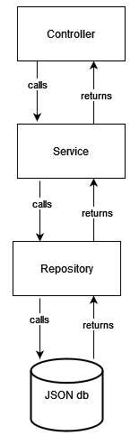
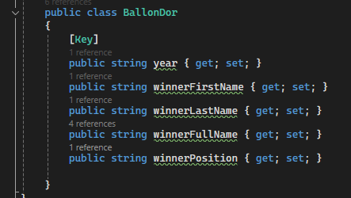
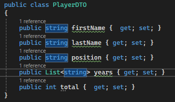
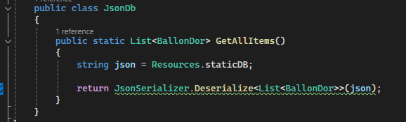
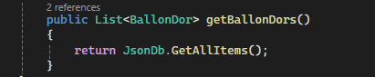
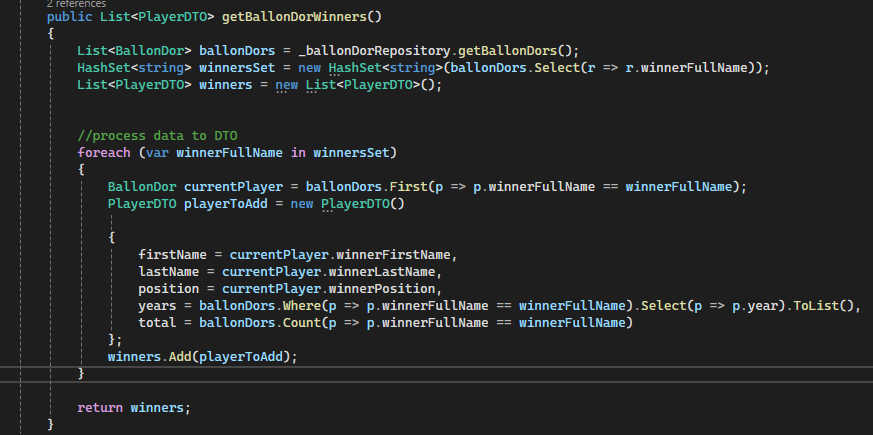
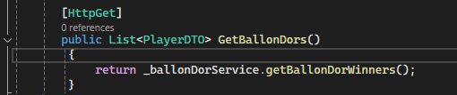
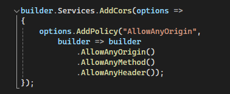

# REST API


## Table of Contents

- [Introduction](#introduction)
- [Layered architecture](#why-choose-a-layered-architecture)
- [Code](#code)
- [Entities](#entities)
    - [Ballon D'or](#ballon-dor-entity)
    - [Player](#player-dto)
    - [JSON](#json-class)
- [Repository](#repository)
- [Service](#service)
- [Controller](#controller)
- [Dependencies](#dependencies)
- [Hosting](#hosting-on-aws)
- [Disclaimer](#cors-disclaimer)
- [Areas of improvement](#areas-of-improvement)

## Introduction
I created a simple REST API using C#. I am using a layered architecture with a static JSON database. The reason for the JSON database as opposed to a regular SQL database is 
to avoid having to host the data online for a simple project where the goal is to showcase my ability to develop a quality API, and not my ability to create tables. <br><br>
I also want to highlight that, had this been a "reel" project, the database entity would have been more suited to what we are achieving with this application. Having a schema
which was not well tailored to the data displayed in the UI helped emphasize the role of the different layers in the backend. It also allowed me to have some changes made to the data in the React file. <br><br>
In a "reel" project, we would want to reduce data manipulation as much as possible, allowing for better performance. This would be achieved by having a better schema to begin with. <br><br>
For this API, I only created one endpoint. PUT, POST, and DELETE requests are not much more complicated than the GET request implemented here. Again, more than creating the perfect API, the goal of this project
is to show which steps I usually follow when creating a new API, and what each layer is responsible for. <br><br>
To avoid making the usual bookstore we tend to go for, I created a Ballon D'or API, where the database contains a BallonDor object, and where the GET endpoint returns a list of Ballon d'Or winners, a PlayerDTO object.

## Why choose a layered architecture?
A layered architecture helps a lot with code testability, maintainability and readability. It's also a natural way to promote separation of concerns, modularity and abstraction, which then helps avoid bad smells.<br>
Thanks to the clear separation of concerns, development and collaboration are significantly simplified.  Additionally, the modular nature supports scalability and adaptability, enabling the system to evolve over 
time to meet changing requirements and incorporate new features and technologies without compromising integrity. <br><br>
Here is a small illustration of what the architecture looks like: <br><br>

<br>
The controller contains the endpoints and an instance of the service. It'll call the service. The service contains the logic of the application and an instance of the repository. 
The repository contains an instance of the database (not in this application because of the static database it consumes, but it usually would).

## Code
Please feel free to click on any of the screenshots below to access the file displayed. If you have any questions, feel free to reach out to me via 
[LinkedIn](https://www.linkedin.com/in/karim-benhallam-192a84196/ 'linkedin profile').

## Entities
There are 3 classes in our [Models](BallonDorEntities/Models) folder. We have a BallonDor entity, a Player DTO, and a JSONDb class which Deserializes our JSON database to create a list of BallonDor entities. <br>
It might have been better to create the DTO class in the Service layer in order to avoid confusion between Database entities and DTO return objects which are not used at this level of the application. <br>

#### Ballon D'or Entity
This is the entity we have in our database. Fairly striaght-forward, and given that only one Ballon D'or award is given each year, we can use the "year" field as our unique key. <br><br>
[](BallonDorEntities/Models/BallonDor.cs)

#### Player DTO
This is the DTO we are returning at the end of our call. <br><br>
[](BallonDorEntities/Models/PlayerDTO.cs)

#### JSON class
This is a very simple class that retrieves the data stored in the project resources, and uses the ```JsonSerializer.Deserialize ``` method to create the list our repository returns. The method is also static in order to be able to call it without instantiating the class.<br>
[](BallonDorEntities/Models/JsonDb.cs)

## Repository

Part of the DataAccess sub-project, its purpose is to retrieve data from the database. It usually has an instance of DbContext, and the data to return can be processed using LINQ. <br>
if we had a DbContext, our get functions would have looked like ```_context.BallonDors.ToListAsync() ``` <br><br>
[](DataAccess/Repositories/Implementations/BallonDorRepository.cs)<br><br>
And to create the DbContext, we would have had a class that looked like <br>
```
DbContextName : DbContext{
  public DbSet<BallonDor> BallonDors {  get; set; }
  public DbContextName(DbContextOptions<DbContextName> options) : base(options) { }
}
```

## Service

Part of the Processor sub-project, its purpose is to carry out the application's logic. In other words, this is where the bulk of the code should be. <br>
In this case, this is where the BallonDor list is processed to create a PlayerDTO list. We create a set containing the "winnerFullName", then we iterate over this set to populate
the list we want to return. Nothing too complicated here. <br><br>
[](BallonDorProcessor/Services/Implementations/BallonDorService.cs)

## Controller

Part of the WebAPI sub-project, its purpose is simply to create the endpoint and call the service. We just add the ``` [HttpGet] ``` decorator above the function to make it work. <br><br>
[](BallonDor/Controllers/BallonDorController.cs)

## Dependencies
- Visual Studio 2022
- C#
- AWS Toolkit

## Hosting on AWS

Altough I have experience with Azure DevOps, I had never used AWS up to this point. It was a fairly easy process as I followed this excellent [tutorial](https://www.youtube.com/watch?v=ngrb-7-9MaM 'tutorial video').
As mentionned in the dependency section, you will need the AWS ToolKit extension in order to follow the tutorial.

## Cors disclaimer

In order to make the development and testing easier for myself, I created a very permissive CORS policy. Although it can be fine to do this at the developmment stage,
it is highly discouraged to have this kind of policy at production level, as it compromises your API's security. When creating your API, make sure to take this into consideration <br> <br>
[](BallonDor/Program.cs)

## Areas of improvement

- Have a schema which is more tailored to what the application wants to achieve
- Correct the CORS policy
- Remove the PlayerDTO class from Models folder to avoid confusion
- Add details about the players (club and country they represented, stats and/or trophies won that year)
- Develop a website displaying only the data in a similar table to the one on the current website with the added information, as there isn't such a tool available online
- Work on website SSO in order to help as many people as possible


