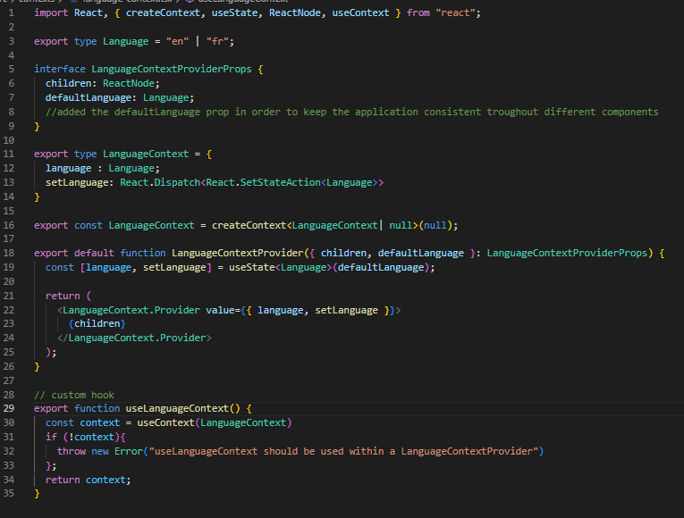
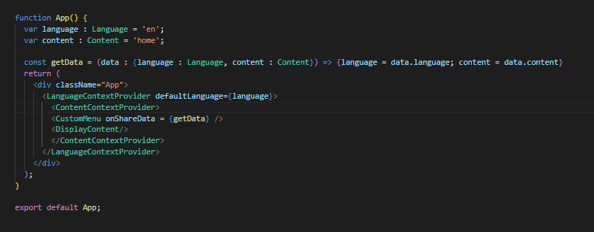
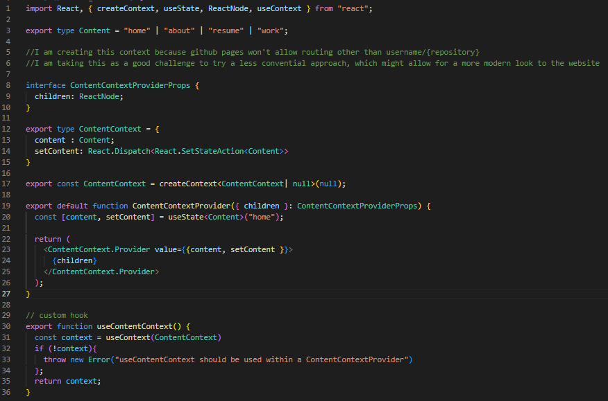

# Personal Website

## Table of Contents

- [Introduction](#introduction)
- [Hosting on GitHub pages](#hosting-on-github-pages)
- [Code](#code)
- [Context and custom hooks](#context-and-custom-hooks)
- [Routing](#routing)
- [Prime](#prime)
- [Areas of improvement](#areas-of-improvement)

## Introduction

I decided to create a personal website to go beyond the confines of a traditional two page résumé. I saw this as a great
opportunity to teach myself React, so that's the technology I am using. I remembered hosting web pages with GitHub pages
for a class back in the second year of my software engineering degree, so I decided to host this personal page on here as well,
as it is easy to use, free of costs, and it helps keep everything in the same place. <br>
It came with some small challenges, especially routing, as I will explain in the [routing](#routing) section. <br>
When it comes to resources, being new to react, I used a good amount of youtube videos and google searches. Thanks
to my experience in angular, it was not too hard to pick up the language quickly.

## Hosting on GitHub pages

As mentionned in the introduction, my page is hosted on GitHub pages. I followed this very good 
[guide](https://github.com/gitname/react-gh-pages 'link to guide') in order to first set up this repository
for the react app. <br>
Every time I want to deploy my changes, I use the command down below: <br>
```
npm run deploy
```

## Code
Please feel free to click on any of the screenshots below to access the file displayed. You can also browse through this repository
as you please. If you have any questions, feel free to reach out to me via 
[LinkedIn](https://www.linkedin.com/in/karim-benhallam-192a84196/ 'linkedin profile').


## Context and custom hooks

A concept which was rather new to me was the use of contexts. I was lucky to come across this great concise 
[video](https://www.youtube.com/watch?v=I7dwJxGuGYQ 'link to video') which helped me better understand the concept, and use it as 
I pleased. <br>
I wanted to make my personal website bilingual, and the custom hook seemed to be the best way to go about it. So I first created 
the custom hook by following the tutorial, but when changing components it would reload the hook everytime, and since the default value
was english, it would always go back to english when browsing the website, which was obviously an important bug to fix. <br>
By making the app component communicate with the custom menu (child to parent) and the language context provider (parent to child), 
I was able to fix this bug. The [language context](src/contexts/language-context.tsx) now has a default language property, set by the 
[app.tsx file](src/App.tsx). Since this property is updated every time a different language is selected, the bug is now fixed.<br>
Here is a screenshot of the language context: <br><br>
[](src/contexts/language-context.tsx)<br><br>
And here is a screenshot of the app.tsx file: <br><br>
[](src/App.tsx)<br><br>
I do realize that the way I fixed it makes the language context somewhat redundant, and it might be something to fix in the future.


## Routing

When hosting a web page with GitHub pages, your url looks like http(s)://{username}/github.io/{repo_name}. <br>
So when I first started coding my app, I tested it on my localhost, with "traditional" routing. When I first deployed
it, and had a 404 error, I did not think much of it. I understood the GitHub url policy, and thought that using a custom
domain would fix the issue. <br>
As it turns out, I assumed wrong, but without panicking, I saw this as an opportunity to learn something a bit more complex
than basic routing. I had gotten familiar with the use of contexts in React, so I decided to implement my 
[content context](src/contexts/content_context.tsx). Here is a screenshot of the code: <br><br>
[](src/contexts/content_context.tsx) <br><br>
As mentioned in the file's comments, I tried to use this as an opportunity to add animations
to the content when it appears and/or disappears. When trying some more complex but aesthetically appealing 
animations, I encountered some problems, with the invisible components conflicting with the displayed components.
I settled for an easier approach for now, but I will definitely look into adding functionning fancy animations when I have time for it. <br>
At that point of the development, it just was not a priority.

## Prime

Ever since I discovered the Prime suite using [PrimeNG](https://primeng.org/ 'link to prime angular'), I used it in most if not all of my
projects. For this personal web page, I used [PrimeReact](https://primereact.org/ 'link to prime react') for various components as well.<br>
If you are not familiar with Prime, it offers a very rich set of open source customizable UI components. Their documentation is thorough, 
and their [GitHub](https://github.com/primefaces/primereact 'link to prime github') is active. <br>
I also used [PrimeFlex](https://primeflex.org/ 'link to primeflex') which is, as they describe, "a lightweight responsive CSS utility library 
to accompany Prime UI libraries and static webpages". <br>
I rate all these tools a lot, and have a lot of respect and gratitude for the developers behind them.

## Areas of improvement

- Improve animations for a more modern look to the website
- Refactor language handling (could use language as a property of the DisplayContent component)
- Create a light mode, and allow visitors to choose which theme they prefer to use
- Use cached data to determine the default language to display
- Improve the logo's image quality
