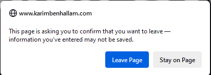

# Snake Game with Pygame

A simple Snake Game implementation using the Pygame library.

## Table of Contents

- [Overview](#overview)
- [Features](#features)
- [How to Run](#how-to-run)
- [Controls](#controls)
- [Game Over](#game-over)
- [Dependencies](#dependencies)
- [Hosting](#hosting-online)
- [Code](#code)
- [Areas of improvement](#areas-of-improvement)

## Overview

This Snake Game is a classic arcade-style game where the player controls a snake to eat apples and grow longer. The game is implemented in Python using the Pygame library.

## Features

- Snake movement in four directions (up, down, left, right)
- Apples appear randomly on the screen for the snake to eat
- Score counter displaying the number of apples eaten
- Pause/Play functionality with a corresponding message
- Game over screen with restart and quit options

## How to Run

1. Ensure you have Python and Pygame installed.

   ```bash
   pip install pygame
   ```

2. Download the Snake Game code.

3. Open a terminal in the directory where the code is saved.

4. Run the game:

```bash
python snake_game.py
```

## Controls

    Use the arrow keys (Up, Down, Left, Right) to control the snake's movement.
    Press the space bar to pause or resume the game.

## Game Over

The game ends if the snake collides with the screen boundaries or itself. A game over message will be displayed.
Restarting the Game

After a game over, you can restart the game by pressing 'R' or quit by pressing 'Q' when prompted.


## Dependencies

    Python 3.x
    Pygame library

## Hosting online

I tried various approaches trying to host it online, and to embed it to the react app. The best approach ended up
being the pygbag library. This adds an extra dependency to the project, which you can install using : <br>
``` pip install pygbag ```<br><br>
There are a few modifications to make to the code in order to make it async aware, and in order to achieve that,
I followed this very good [guide](https://medium.com/@msgold/from-desktop-to-web-deploying-pygame-projects-with-pybag-a4344a7e06ee 'detailed guide link'). <br>
Once the modifications are done, you can create the files necessary to the online hosting by using: <br>
``` python -m pygbag .\main.py ``` <br><br>
This will also run the game locally on localhost:8000, and you will be able to test the functionality of your game on a browser. <br>
Once you're happy with the result, you can host it on github pages the same way I did, by following this great 
[tutorial video](https://www.youtube.com/watch?v=RDkfbASO-gM 'link to tutorial video')

## Code
The code is fairly simple to understand as this is an easy game to implement. If you have any questions, feel free to reach out to me via 
[LinkedIn](https://www.linkedin.com/in/karim-benhallam-192a84196/ 'linkedin profile'). Here are the links for the:
- [Local version](local/snake.py)
- [Online version](main.py)

## Areas of improvement
- Allow users to edit the speed, leading to customizable difficulty
- Put text outside of the playable area, making the interface look better
- In the online version, allow users to leave the game, to get rid of the "are you sure you want to leave this page"
  pop-up. (see image below) <br><br>
  <br>
  I've seen two other pygbag games hosted online, and they both had the same issue. There is definitely a solution
  to this problem, but I have not looked into it. <br><br>
  Enjoy playing the Snake Game!
